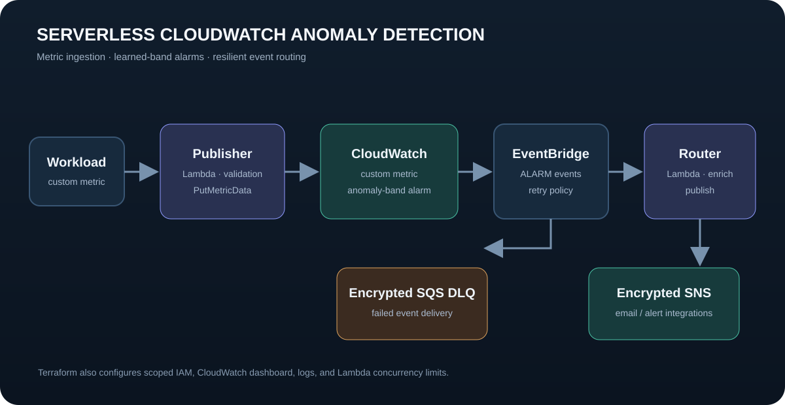

# Serverless CloudWatch Anomaly Detection

[](https://github.com/Samrith-026/serverless-anomaly-detection/actions/workflows/ci.yml)

[Live portfolio](https://durgasamrithuppala.netlify.app/) · Built by [Durga Samrith Uppala](https://github.com/Samrith-026)

A testable observability project with two execution paths: a dependency-free local API for demonstrating rolling-baseline detection and Terraform for an AWS-native CloudWatch anomaly alarm pipeline. The repository includes input validation, least-privilege IAM, encrypted alerting, retry and dead-letter handling, automated tests, and an operations runbook.

## Architecture



The CloudWatch alarm evaluates a learned band over two consecutive one-minute periods. EventBridge forwards only `ALARM` transitions, retries transient failures, and stores exhausted deliveries in an encrypted SQS queue for investigation.

## What this demonstrates

- Validated CloudWatch custom-metric ingestion with dimension and unit controls.
- CloudWatch anomaly-detection math expressed through Terraform.
- Event-driven alarm routing through EventBridge, Lambda, and SNS.
- Least-privilege IAM scoped to one namespace, log groups, and alert topic.
- Encrypted SNS and SQS resources, Lambda concurrency bounds, and 30-day log retention.
- A local rolling-baseline simulator that keeps metric series separate by dimension.
- Bounded in-memory history and outlier exclusion from the learned local baseline.
- Unit, infrastructure-format, Terraform-validation, Compose, and container-build checks in CI.

## Run the local demonstration

The local path requires Docker but no AWS account or credentials.

```bash
docker compose up --build --detach
python scripts/demo.py
docker compose down
```

The demo submits five stable latency values followed by a spike. Inspect the APIs directly at:

| Method | Endpoint | Purpose |
| --- | --- | --- |
| `GET` | `/health` | Container health |
| `POST` | `/metrics` | Validate and evaluate an observation |
| `GET` | `/metrics` | Recent bounded observation history |
| `GET` | `/alerts` | Recent detected anomalies |

Example observation:

```bash
curl -X POST http://localhost:8002/metrics \
  -H "Content-Type: application/json" \
  -d '{"metric_name":"PipelineLatency","value":250,"unit":"Milliseconds","dimensions":{"Service":"orders"}}'
```

### Local detector configuration

| Variable | Default | Meaning |
| --- | ---: | --- |
| `ANOMALY_WINDOW_SIZE` | `20` | Accepted values retained per metric series |
| `ANOMALY_MIN_SAMPLES` | `5` | Samples required before evaluation |
| `ANOMALY_SENSITIVITY` | `2` | Standard-deviation multiplier |
| `ANOMALY_HISTORY_LIMIT` | `1000` | Maximum observations and alerts retained |

## Run verification

```bash
python -m unittest discover -s tests -v
python -m compileall -q src scripts
terraform fmt -check -recursive terraform
docker compose config --quiet
```

GitHub Actions also initializes the Terraform providers, runs `terraform validate`, and builds the container image.

## Optional AWS deployment

Review the plan in a development account before applying it:

```bash
cd terraform
cp terraform.tfvars.example terraform.tfvars
terraform init
terraform validate
terraform plan -out=tfplan
terraform apply tfplan
```

If `notification_email` is set, AWS sends a confirmation request before SNS delivers alerts. The address is stored in Terraform state, so keep state in a protected remote backend for shared environments. AWS resources can incur charges.

Publish a sample metric after deployment:

```bash
aws lambda invoke \
  --function-name anomaly-poc-metric-publisher \
  --cli-binary-format raw-in-base64-out \
  --payload '{"metric_name":"PipelineLatency","value":250,"unit":"Milliseconds","dimensions":{"Service":"orders"}}' \
  response.json
```

CloudWatch needs representative history before its anomaly band becomes useful. The local detector demonstrates the workflow immediately; it does not claim to reproduce CloudWatch's managed model.

## Repository map

```text
src/                 Lambda handlers and local detector API
tests/               Standard-library unit tests with mocked AWS clients
fixtures/            Representative CloudWatch alarm event
scripts/demo.py      End-to-end local demonstration
terraform/           AWS alarm, routing, IAM, dashboard, SNS, and DLQ
RUNBOOK.md            Triage, recovery, tuning, and failure procedures
```

See [RUNBOOK.md](./RUNBOOK.md) before operating the AWS path.
